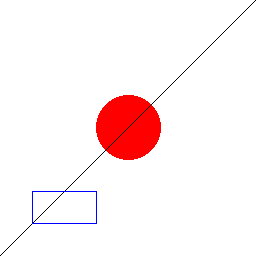
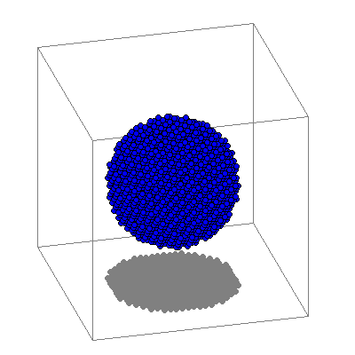

# Windows Bitmap File を吐く

## はじめに

Windows Bitmap Fileを吐くためのC++ シングルヘッダライブラリを作りました。

[https://github.com/kaityo256/winbitmap](https://github.com/kaityo256/winbitmap)

こんな風に使います。

```cpp
#include "winbitmap.hpp"

int main() {
  // Prepare a canvas (width, height)
  winbitmap::canvas canvas(256, 256);

  // Draw a filled rectangle
  canvas.set_color(255, 255, 255);
  canvas.fill_rect(0, 0, 256, 256);

  // Draw a filled circle
  canvas.set_color(255, 0, 0);
  canvas.fill_circle(128, 128, 32);

  // Draw a line
  canvas.set_color(0, 0, 0);
  canvas.moveto(0, 0);
  canvas.lineto(256, 256);

  // Draw a rectangle
  canvas.set_color(0, 0, 255);
  canvas.draw_rect(32, 32, 64, 32);

  canvas.save_to_file("test.bmp");
  std::cout << "Saved to test.bmp" << std::endl;
}
```

上記をコンパイル、実行すると、以下のようなビットマップファイルを吐きます。



色の指定と、線、円、長方形しか描画できませんが、STL以外に必要なライブラリはないので、だいたいどこでも動くと思います。ただし、エンディアンは考慮していないので、ビッグエンディアンのマシンで実行するとおかしくなるかもしれません。

いまどきこんなライブラリは不要だと思うのですが、せっかく昔作ったものですし、イエローハットのタイヤ交換の間暇なので、なぜこんなものを作ったかつらつら書いてみようと思います[^1]。

[^1]: イエローハットのタイヤ交換が遅いと文句言ってるわけじゃないですよ。むしろ雪が降りそうだったのであわててタイヤ交換をお願いしてやってもらったので感謝しています。

## なぜ作ったか

私の専門はスパコンを使った分子動力学計算です。分子動力学法というのは、ようするに粒々がたくさんあって、それらを動かすシミュレーションです。さて、シミュレーションをしたら結果を可視化したくなりますね。特に分子動力学法は時間発展をするので、結果をまとめてムービーにしたくなります。

今でこそ粒子系の可視化アプリケーションはたくさんありますが、昔はさほど充実していませんでした。数少ないアプリケーションも、スパコンではビルドに失敗したりして面倒でした。ローカルにデータを持ってくるにしても、大規模な計算をするとかなり大きなファイルをダウンロードしなければならず、結構つらいです。また大量のデータを非力なローカルマシンで可視化するのもしんどい作業でした。

というわけで、スパコンでシミュレーションしながら、ついでに可視化もしたい、というニーズがあったわけです。しかし、今はともかく、昔のスパコンはコンパイラの仕様が古かったりして、必要なライブラリをそろえるのが面倒でした。なので、他のライブラリに依存せずに絵を描く必要がありました。

こういうとき、昔の数値計算屋はよくPostScript を使っていました。PostScriptはテキストファイルなので出力が容易です。しかも描画言語としてはかなり高機能なので、基本的にはなんでもできます。僕もよくPostScriptで出力してラスタに変換、ということをやっていました。

しかし、粒子数が増えてくると、当然ですがPostScriptのファイルサイズも増えてしまいます。また、三次元空間に大量に粒子が浮かんでる状態を可視化すると、見えるのは表面にある粒子だけなのに、PostScriptは全粒子について保存してしまって無駄です。また、でかすぎるファイルをGSに食わせると描画が死ぬほど遅かったりしました。なんらかの方法でラスタ画像を直接保存できる手段が必要でした。

当時もGIFその他で出力するライブラリがあったような気がします。ですが、当時GIFのアルゴリズムのライセンスがよくわからない状態だったのと、外部ライブラリを苦労してコンパイルするのが嫌になっていた僕は、直接Windows Bitmapを吐くことにしたわけです。

## Windows Bitmap Fileの構造

Windows Bitmap File、いわゆる「BMP」ファイルは、Windowsユーザなら馴染み深いフォーマットでしょう。これはDIB (Device Independent Bitmap)などとも呼ばれ、OS/2から使われる歴史あるファイルフォーマットです。実は一口にBMPといっても、解像度や圧縮形式の違い、そしてその組み合わせにより、フォーマットの種類はかなりあります。なので、あるBMPファイルが、こっちのアプリケーションでは読めるけれど、こっちのアプリケーションでは読めない、ということがよく起きます。特に圧縮形式の指定が面倒です。BMPファイルは無圧縮で使われることが多いため、BMPに対応したアプリケーションでも、無圧縮BMPしか読めないことがよくありました。昔、僕はBorland C++ Builderを使っていましたが、そのTCanvas(だったかな？)のデフォルトの保存形式が圧縮型のBMPであることにしばらく気づかず、他のアプリケーションで読めたり読めなかったりするのに苦労したのを覚えてます。

今でも「全ての」BMPに対応するのはかなり大変だと思います。しかし、読むのは大変ですが、吐くのは一種類のフォーマットだけ対応すればよいので簡単です。ここでは24ビットの無圧縮ビットマップを吐くことにしましょう。24ビット無圧縮だと、カラーパレットを保存する必要がないので楽です。やるべきことは`BITMAPFILEHEADER`構造体と`BITMAPINFOHEADER`を保存し、その後でビットマップデータをBGRの順番で並べるだけです(RGBの順番じゃないことに注意)。

一つだけ注意するべき点は、各行は4の倍数に丸められるということです。たとえば、幅102、高さ128の24ビット無圧縮ビットマップファイルを考えます。24ビット無圧縮とは、一つのピクセルを24ビット、つまり3バイトで表現するフォーマットです。なので、一行は102 x 3=306バイトあればよいわけですが、これを一番近い4の倍数に切り上げて308バイトにします。したがって、ビットマップ部分は308 x 128=39424バイトになります。それにヘッダ部分の54バイトを加え、ビットマップファイルは全体で394478バイトになります。

ヘッダについては、以下のソースを見るのが早いと思います。

```cpp
  void save_to_file(const char *filename) {
    DWORD bfSize = image_buffer.size() + 54;
    WORD bfReserved1 = 0;
    WORD bfReserved2 = 0;
    DWORD bfOffBits = 54;

    DWORD biSize = 40;
    DWORD biWidth = width;
    DWORD biHeight = height;
    WORD biPlanes = 1;
    WORD biBitCount = 24;
    DWORD biCompression = 0;
    DWORD biSizeImage = 0;
    DWORD biXPelsPerMeter = 0;
    DWORD biYPelsPerMeter = 0;
    DWORD biClrUsed = 0;
    DWORD biClrImportant = 0;

    std::ofstream fs(filename);
    // BITMAPFILEHEADER
    fs.write("BM", sizeof(WORD));
    fs.write((char *)&bfSize, sizeof(DWORD));
    fs.write((char *)&bfReserved1, sizeof(WORD));
    fs.write((char *)&bfReserved2, sizeof(WORD));
    fs.write((char *)&bfOffBits, sizeof(DWORD));
    // BITMAPINFOHEADER
    fs.write((char *)&biSize, sizeof(DWORD));
    fs.write((char *)&biWidth, sizeof(DWORD));
    fs.write((char *)&biHeight, sizeof(DWORD));
    fs.write((char *)&biPlanes, sizeof(WORD));
    fs.write((char *)&biBitCount, sizeof(WORD));
    fs.write((char *)&biCompression, sizeof(DWORD));
    fs.write((char *)&biSizeImage, sizeof(DWORD));
    fs.write((char *)&biXPelsPerMeter, sizeof(DWORD));
    fs.write((char *)&biYPelsPerMeter, sizeof(DWORD));
    fs.write((char *)&biClrUsed, sizeof(DWORD));
    fs.write((char *)&biClrImportant, sizeof(DWORD));
    // DATA
    fs.write((char *)image_buffer.data(), image_buffer.size());
    fs.close();
  }
```

ここで`image_buffer`は、BYTE、つまり`unsigned char`型の`std::vector`です。24ビット無圧縮と決めてしまえば、構造体で設定する部分は全体のファイルサイズと幅と高さだけなので楽ちんですね。

## 粒子系の可視化

このライブラリは線と丸と四角しか描けませんが、粒子系の可視化をするのはそれで十分です。というわけで、粒子の座標を食わせて可視化するサンプルも作りました。三次元座標を格納した`std::vector`を渡すとこんな感じのファイルを吐きます。



粒子の座標を一次変換して、z座標でソートして順番に描画するだけのコードです。手抜きなので枠の上に粒子を描いてしまってますが気にしないでください。これができれば分子動力学法コードの結果を保存するのは楽にできると思います。

## まとめ

BMPファイルを吐くライブラリを作ってみました。STL以外のライブラリに依存しないのでどこでも動きます。といっても、今はVMDやcdviewなど、可視化アプリケーションも豊富にありますし、そもそもイメージを出力するライブラリもいろいろあるので、こういうライブラリは必要ないでしょう。これは、そういうのが無かった時代に、数値計算屋が自分のシミュレーション結果を可視化するために作ったものです。先日、リポジトリの整理をしていたらBMP出力コードが出てきたので、ちょっとだけ整理して、GitHubとQiitaに葬っておきます。R.I.P.